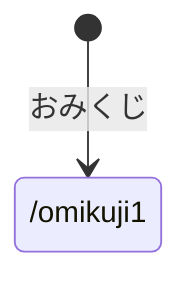
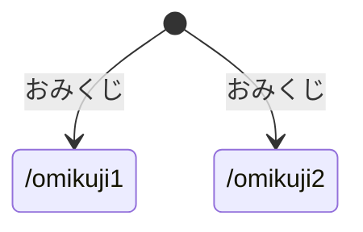
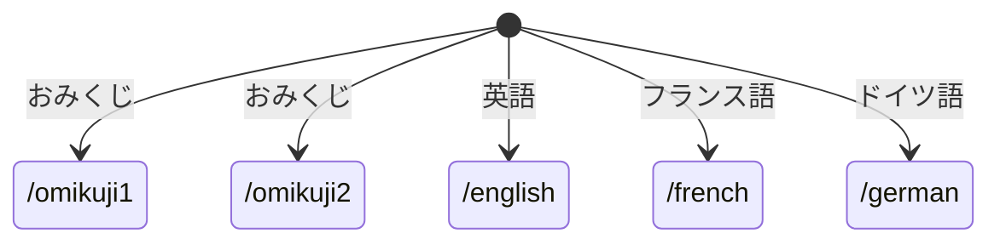
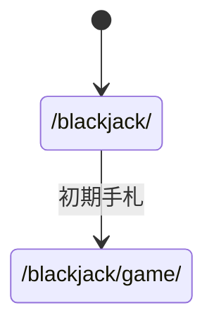

# 設計

## 1. omikuji1

```mermaid
stateDiagram-v2
    [*] --> o1:おみくじ
    o1:/omikuji1
```

## 2. omikuji2

```mermaid
stateDiagram-v2
    [*] --> o1:おみくじ
    [*] --> o2:おみくじ
    o1:/omikuji1
    o2:/omikuji2
```

## 3. integ

```mermaid
stateDiagram-v2
    [*] --> o1: おみくじ
    [*] --> o2: おみくじ
    [*] --> le: 英語
    [*] --> lf: フランス語
    [*] --> lg: ドイツ語
    o1: /omikuji1
    o2: /omikuji2
    le: /english
    lf: /french
    lg: /german
```

## 4. blackjack

```mermaid
stateDiagram-v2
    [*] --> stt
    stt: /blackjack/
    stt --> game: 初期手札
    game: /blackjack/game/

```
